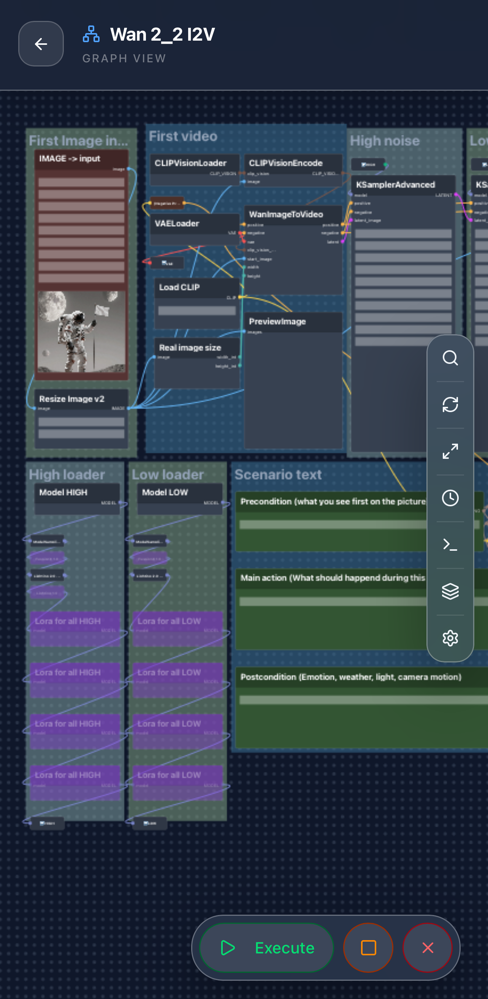
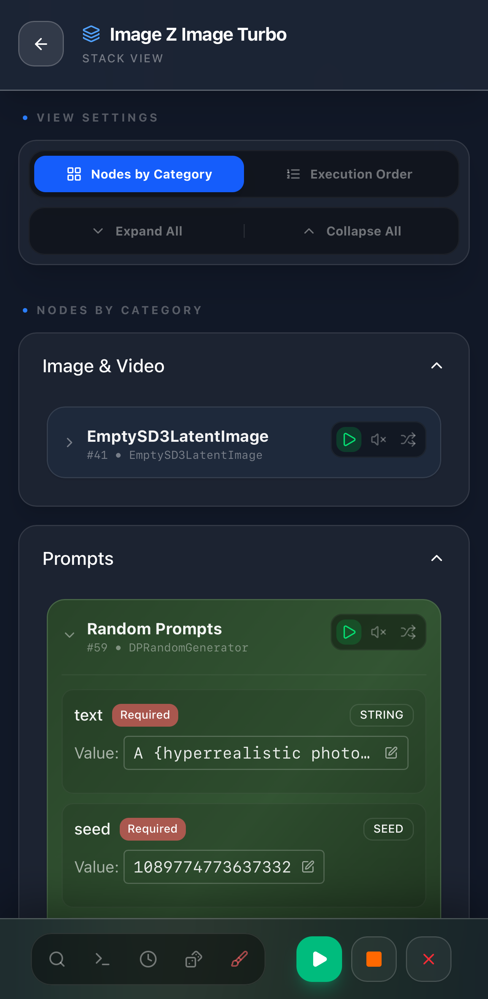
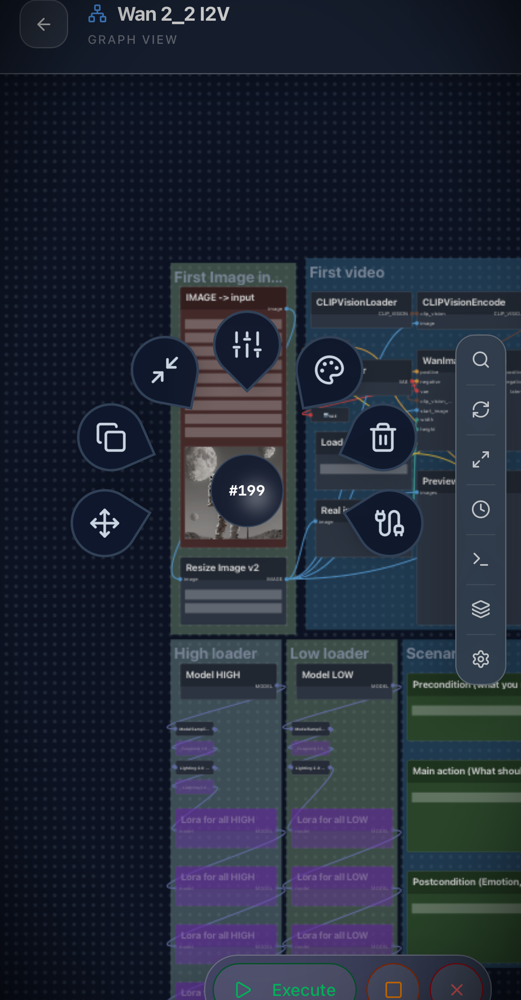
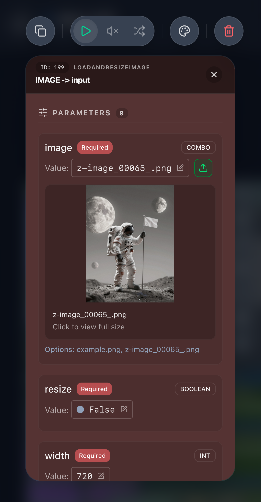
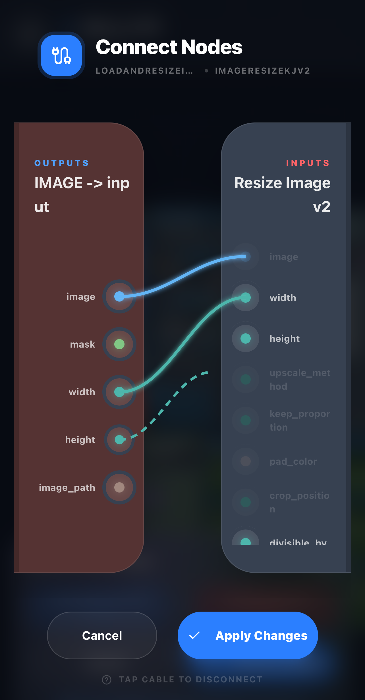
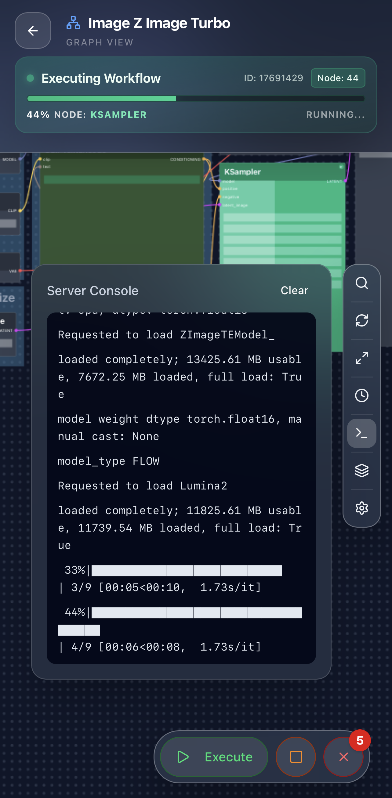
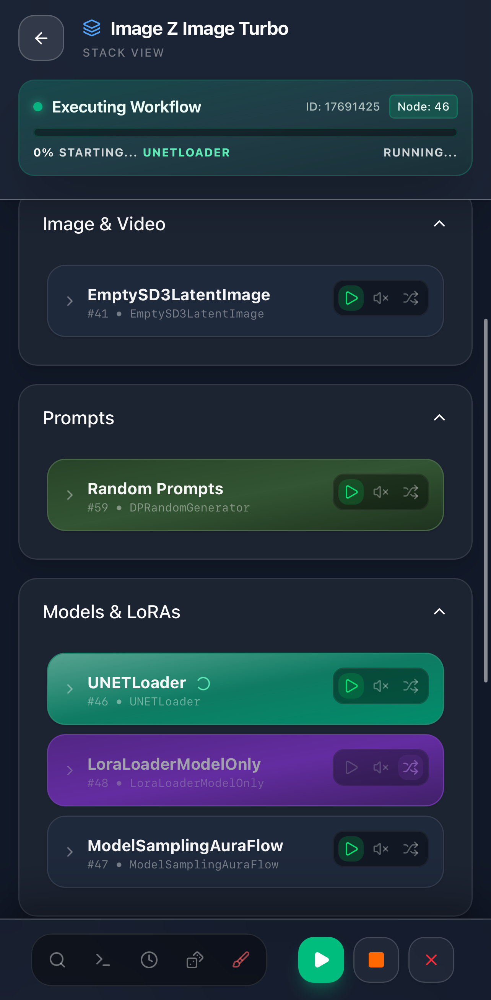
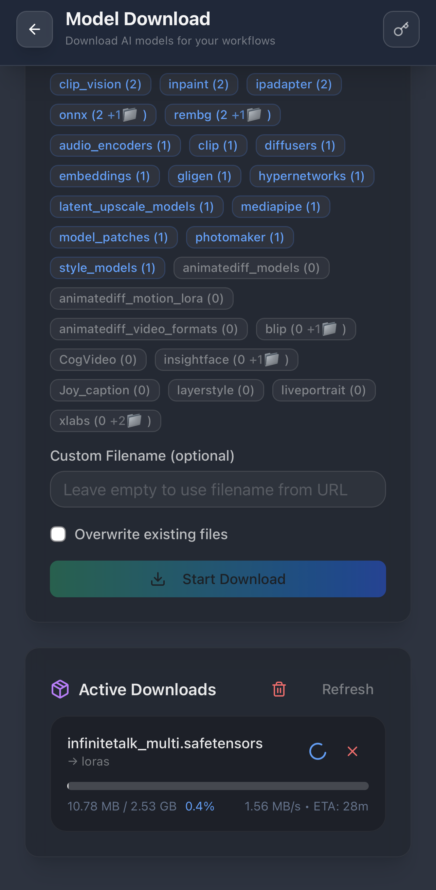
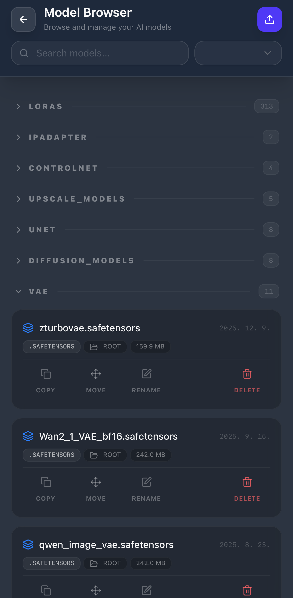

*Read this in other languages: [한국어](NEW_README_KOR.md)*
<div align="center">

# Comfy Mobile UI

**Mobile-first, node-style web interface for ComfyUI**

[Key Features](#features) | [Installation Guide](#installation) | [Contributing](#contributing) | [Show Your Support](#support)

---

<p align="left">
  
  
  
</p>
</div>

## 📖 Introduction

**Comfy Mobile UI** is a mobile-first web interface designed to seamlessly handle node-based AI workflows on mobile devices, originally optimized for PC environments.

This is not just a simple viewer. Modify complex workflows on the go, add new nodes, manage models, and monitor execution status in real-time. Experience a desktop-like environment on your mobile device with a touch-optimized UX.

---

## <a name="features"></a>✨ Key Features

### 1. Multi-Mode Support
Provides both a powerful **Graph View** for freeform workflow editing and a **Stack View** for intuitivel modifying widget values by grouping nodes by type.

<div align="center">
  
  
</div>

### 2. Touch-First UX
Perfectly reimagines complex desktop editing experiences for mobile gestures. Control intricate node graphs with ease using just your fingers.
- **Radial Menu:** Quickly access node addition, removal, color change, and execution mode (Always, Mute, Bypass) with a single long-press.
- **Advanced Widget Editor:** Comfortably edit node widgets in a dedicated large modal. Easily import images and videos from your device's album or the generated gallery.
- **Precision Linking:** Precisely configure connection lines between nodes using an intuitive drag-and-drop interface specifically designed for smaller screens.

<div align="center">
  
  
  
</div>

### 3. Execution & Monitoring
Provides powerful tools to track execution status in real-time and manage the queue.
- **Live Progress:** Visually monitor the current executing node and overall progress in real-time.
- **Server Console:** Monitor server execution logs in real-time to check the overall system status.

<div align="center">
  
  
</div>

### 4. Easy Resource Downloader
Install required models directly via URL without needing to access the server manually.
- **Remote Download:** Directly download Checkpoints, LoRAs, etc., to the server using model links from Hugging Face, Civitai, and more.
- **Target Folder Selection:** Directly specify the target folder for downloads to systematically manage resources by model type.

<div align="center">
  
  
</div>

### 5. Unified Media Library
Instantly view and manage generated images and videos (MP4) within the app without needing a separate gallery.
- **In-App Gallery:** Offers smooth playback and viewing for everything from high-fidelity outputs to video previews.
- **Seamless Export:** Check outputs instantly and save them to local storage or share them externally.
<div align="center">
  
  
</div>

### 6. Advanced Utilities
Provides smart tools to make workflow editing and management even more efficient.
- **Workflow Snapshots:** Save the current state of your workflow as a snapshot and restore it at any time. Ideal for fearless experimentation with parameters.
- **Embedded Group Control:** Built-in Fast Group Muter/Bypasser (from rgthree) to bulk control execution modes (`Always`, `Mute`, `Bypass`) of all nodes within a group.
- **Trigger Word Manager:** Save and manage trigger words for each LoRA in the Model Browser. Quickly lookup and copy keywords while editing workflows.
- **Advanced Video Downloader:** Use [yt-dlp](https://github.com/yt-dlp/yt-dlp) to download videos from various platforms directly to the server's `input` folder.
- **Workflow Chain (Experimental):** Link multiple independent workflows together. Automatically transfer output from one workflow to the input of the next for complex, sequential automation.

---

## <a name="installation"></a>🛠️ Installation & Setup

### **Prerequisites**
- Node.js 18+ and npm
- Running ComfyUI server (typically `http://localhost:8188`)
- **Required**: ComfyMobileUI API Extension

### **IMPORTANT: API Extension Setup**

**This step is required** - The API extension is necessary for ComfyMobileUI to function correctly.

1. **Copy API Extension**:
   ```bash
   # Copy the entire comfy-mobile-ui-api-extension folder to your ComfyUI custom_nodes directory
   cp -r comfy-mobile-ui-api-extension /path/to/your/comfyui/custom_nodes/
   ```

2. **Restart ComfyUI**:
   ```bash
   # Start ComfyUI - The API extension will be automatically installed and loaded
   python main.py --enable-cors-header
   ```

**IMPORTANT**: The API extension provides core functionality (nearly all features) that ComfyMobileUI depends on. It will not work properly without it.

### **Development Setup**

```bash
# Clone the repository
git clone https://github.com/jaeone94/comfy-mobile-ui.git
cd ComfyMobileUI

# Install dependencies
npm install

# Start development server
npm run dev

# Open in browser
# Navigate to http://localhost:5173
```

### **Production Build**

```bash
# Build for production
npm run build

# Preview production build
npm run preview

# Lint code
npm run lint
```

### **ComfyUI Server Setup**

Check the following for your ComfyUI installation:

1. **API Extension Installed**: `comfy-mobile-ui-api-extension` copied to `custom_nodes/`
2. **CORS Enabled**: Started with the `--enable-cors-header` flag
3. **Network Access**: Use `--listen 0.0.0.0` for external network access (optional)

```bash
# Example ComfyUI start command
python main.py --enable-cors-header --listen 0.0.0.0
```

---

## <a name="contributing"></a>🤝 Contributing

**Contributions are always welcome!**

### **Code Quality Notice**
Much of this app was developed using "vibe coding," so code quality may vary. We appreciate your understanding and welcome improvements!

### **How to Contribute**
1. Fork the repository
2. Create a feature branch (`git checkout -b feature/amazing-feature`)
3. Commit your changes (`git commit -m 'Add amazing feature'`)
4. Push to the branch (`git push origin feature/amazing-feature`)
5. Open a Pull Request

---

## <a name="support"></a>⭐ Show Your Support

⭐ **If you find this app useful, please consider giving it a star!** ⭐

Your support helps the project grow and motivates continued development.

---