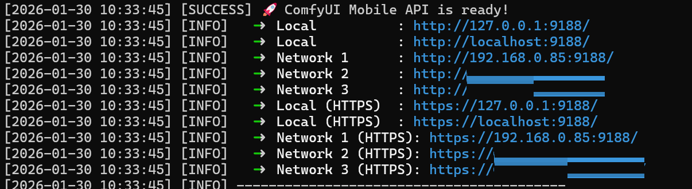
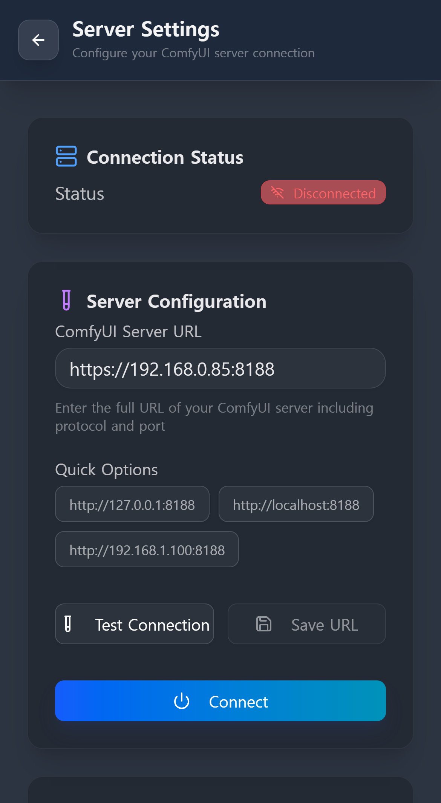

[English](./connection_guide.md) | [한국어](./connection_guide_kor.md) | [日本語](./connection_guide_jp.md) | [简体中文](./connection_guide_zh.md)

# ComfyUI Mobile UI 接続ガイド

このガイドでは、モバイル機器をComfyUIサーバーに接続する全手順を説明します。

## ステップ 0: ComfyUI Mobile UIにアクセスする
サーバー設定を行う前に、まずモバイルブラウザで「Mobile UI」のウェブ画面にアクセスする必要があります。

  

> [!TIP]
> 拡張機能の起動時にコンソールに表示される **"🚀 ComfyUI Mobile API is ready!"** 下のアドレスリストを参考にしてください。
> - **同じWiFi環境:** `http://192.168.x.x:9188` (9188ポートを使用)
> - **外部/VPN環境:** `http://100.x.x.x:9188` など、コンソールに表示された利用可能なネットワークアドレス

---

## ステップ 1: ComfyUIサーバーの接続設定
Mobile UIにアクセスした後、アプリ内の **[Server Settings]** メニューから実際のComfyUIエンジン（デフォルト 8188ポート）と接続します。

## 📱 サーバー接続画面

  
  

> *「Server Settings」メニューで、お使いの環境に応じたアドレスを入力してください。*

### 1. 同じWiFi（LAN）環境の場合
スマートフォンとPCが同じWiFiルーターに接続されている場合です。
- サーバーを実行しているPCの **プライベートIP (Private IP)** を入力してください。
- **入力例:** `http://192.168.0.85:8188`

### 2. 外部ネットワークから接続する場合 (LTE/5G/外部WiFi)
外出先から接続するには、サーバーが外部からのリクエストを受け付ける準備ができている必要があります。
- **必須条件:** ComfyUI起動時に `--listen` または `--listen 0.0.0.0` 引数を追加する必要があります。
- **方法:** **Tailscale** などのVPNサービスを使用するか、ルーターで **ポートフォワーディング** を設定してください。
- **重要なポイント:** 使用するツールに関わらず、**モバイルブラウザから実際に接続可能なIPアドレス**を入力する必要があります。（例: `http://100.90.xx.xx:8188`）

> [!CAUTION]
> **セキュリティ上の注意 (ハッキング防止)**
> ポートフォワーディングを使用する場合、セキュリティのためにルーターの **外部ポート (External Port)** とPCの **内部ポート (8188)** を異なる値に設定することを強く推奨します。
> （例: 外部 12345ポート -> 内部 8188ポートに転送）

### 3. ComfyUIで証明書 (SSL/TLS) を使用する場合
起動引数に `--tls-keyfile` および `--tls-certfile` を指定している場合です。
- この場合、ComfyUIは **`https://` 接続のみを許可**します。
- 必ずアドレスの先頭に `https://` を付けて入力し、そのアドレスがモバイル機器からSSL接続可能であることを確認してください。
- **入力例:** `https://192.168.0.85:8188`
