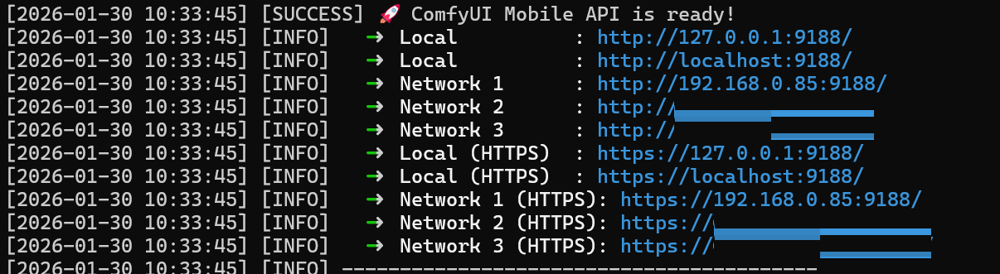
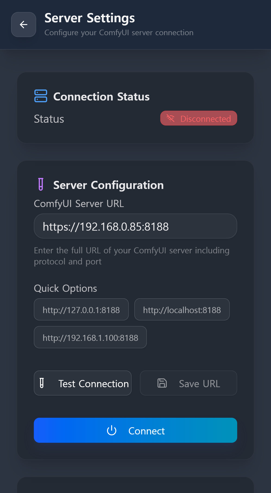
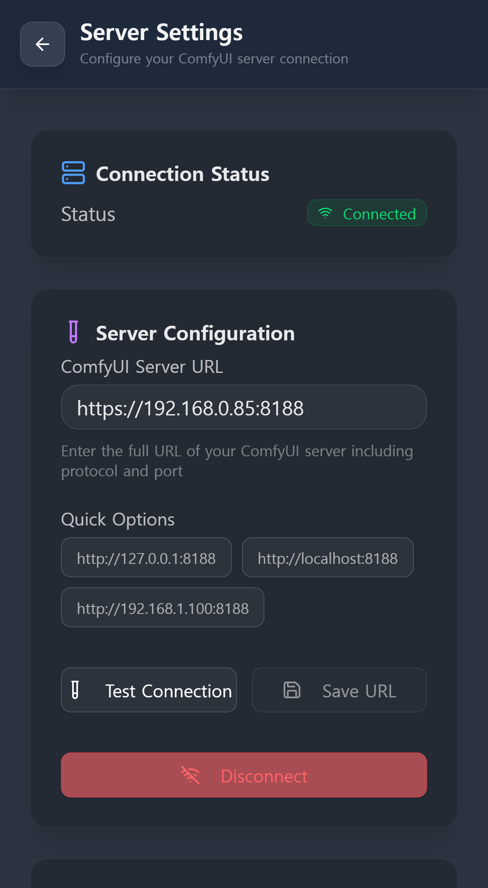

[English](./connection_guide.md) | [한국어](./connection_guide_kor.md) | [日本語](./connection_guide_jp.md) | [简体中文](./connection_guide_zh.md)

# ComfyUI Mobile UI 접속 가이드

이 가이드는 모바일 기기를 ComfyUI 서버에 연결하는 전체 절차를 설명합니다.

## 0단계: ComfyUI Mobile UI 접속하기
서버 설정으로 들어가기 전, 먼저 모바일 브라우저에서 'Mobile UI' 웹 화면에 접속해야 합니다.

  

> [!TIP]
> 런처 서비스가 시작될 때 콘솔에 표시되는 **" ComfyUI Mobile API is ready!"** 하단의 주소 목록을 참고하세요.
> - **같은 WiFi 환경:** `http://192.168.x.x:9188` (9188 포트 사용)
> - **외부/VPN 환경:** `http://100.x.x.x:9188` 등 콘솔에 표시된 가용한 네트워크 주소

---

## 1단계: ComfyUI 서버 연결 설정
Mobile UI 접속 후, 앱 내의 **[서버 설정]** 메뉴에서 실제 ComfyUI 엔진(기본 8188 포트)과 연결해야 합니다.

## 📱 서버 연결 화면

  
  

> *설정 메뉴의 "서버 설정"에서 아래 환경에 맞는 주소를 입력하세요.*

### 1. 같은 와이파이(LAN) 환경일 때
모바일 폰과 PC가 동일한 와이파이 공유기에 연결되어 있는 경우입니다.
- 서버가 실행 중인 PC의 **사설 IP(Private IP)**를 입력하세요.
- **입력 예시:** `http://192.168.0.85:8188`

### 2. 외부망에서 접속할 때 (LTE/5G/외부 와이파이)
집 밖에서 접속하려면 서버가 외부 요청을 받을 준비가 되어 있어야 합니다.
- **필수 조건:** ComfyUI 실행 시 `--listen` 또는 `--listen 0.0.0.0` 인자를 넣어야 합니다.
- **방법:** **Tailscale** 같은 VPN 서비스를 사용하거나 공유기에서 **포트 포워딩**을 설정하세요.
- **핵심:** 사용 중인 도구와 상관없이, **모바일 브라우저에서 실제로 접속 가능한 IP 주소**를 넣어야 합니다. (예: `http://100.90.xx.xx:8188`)

> [!CAUTION]
> **보안 주의 (해킹 방지)**
> 포트 포워딩을 사용할 경우, 보안을 위해 공유기의 **외부 포트(External Port)**와 PC의 **내부 포트(8188)**를 서로 다르게 설정하는 것을 강력히 권장합니다.
> (예: 외부 12345 포트 -> 내부 8188 포트로 연결)

### 3. ComfyUI에서 인증서(SSL/TLS)를 사용하는 경우
실행 인자로 `--tls-keyfile` 및 `--tls-certfile`을 넣은 경우입니다.
- 이 경우 ComfyUI는 **`https://` 접속만 허용**합니다.
- 반드시 주소창에 `https://`를 붙여서 입력해야 하며, 해당 주소가 모바일 기기에서 SSL 연결이 가능한 주소인지 확인하세요.
- **입력 예시:** `https://192.168.0.85:8188`

### 4. ComfyUI-Login을 사용하는 경우
서버가 [ComfyUI-Login](https://github.com/liusida/ComfyUI-Login)으로 보호되어 있다면:
- **서버 설정 > 인증**에서 **ComfyUI-Login**을 선택하세요.
- ComfyUI 콘솔의 `For direct API calls, use token=` 뒤에 출력되는 값을 복사하여 **API 토큰**에 붙여넣으세요.
- 일반 비밀번호가 아니라 생성된 API 토큰을 사용해야 합니다. 토큰은 `<ComfyUI>/login/PASSWORD` 파일의 첫 번째 줄에서도 확인할 수 있습니다.
- 기본적으로 토큰은 현재 브라우저 세션에만 유지됩니다. **이 기기에서 로그인 유지**를 켜면 토큰이 기기에 저장되어 탭을 닫아도 다시 입력할 필요가 없으며, 이때 토큰은 브라우저 데이터 백업에도 포함됩니다. 공용 기기에서는 끄고 사용하세요.

> [!WARNING]
> API 토큰은 비밀번호처럼 취급하세요. 신뢰할 수 없는 네트워크에서는 HTTPS를 사용해야 합니다.
